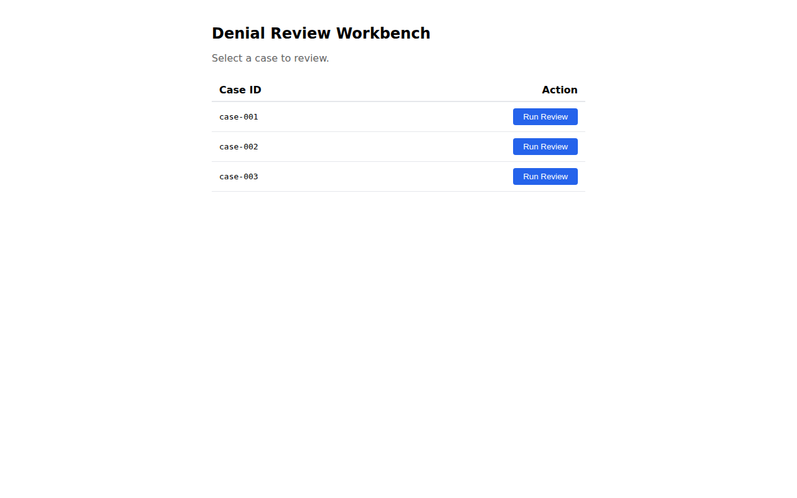
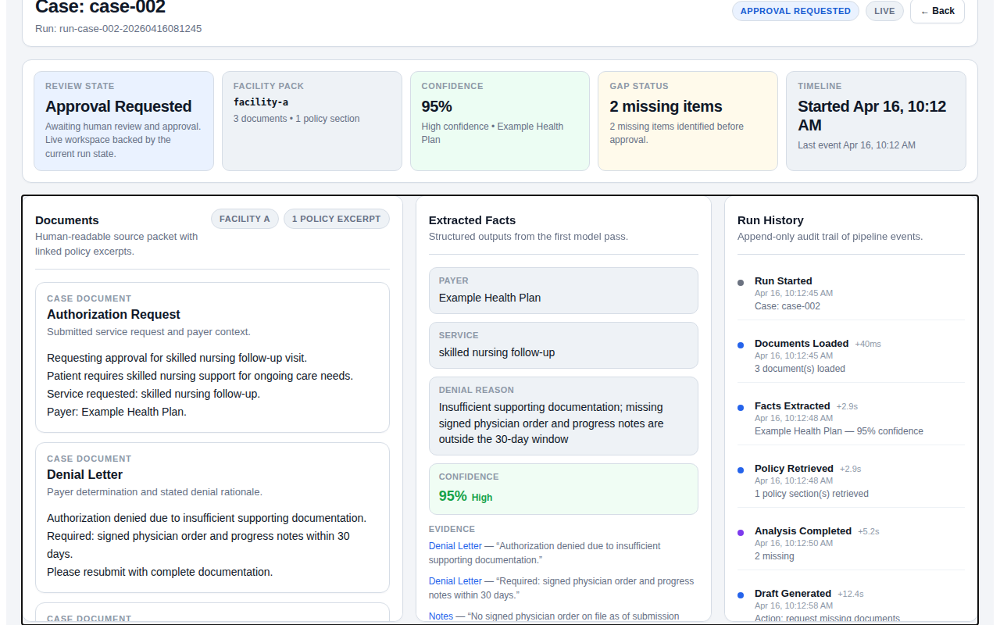
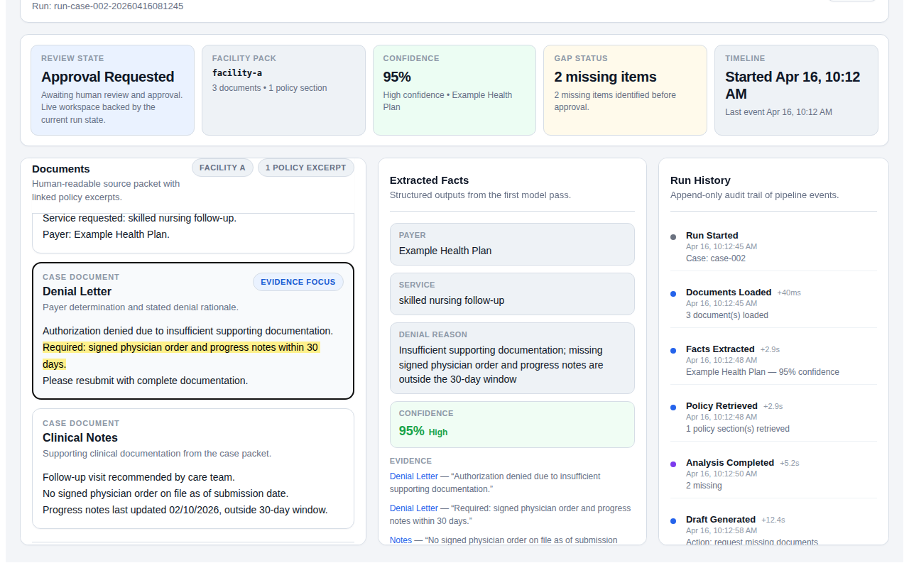
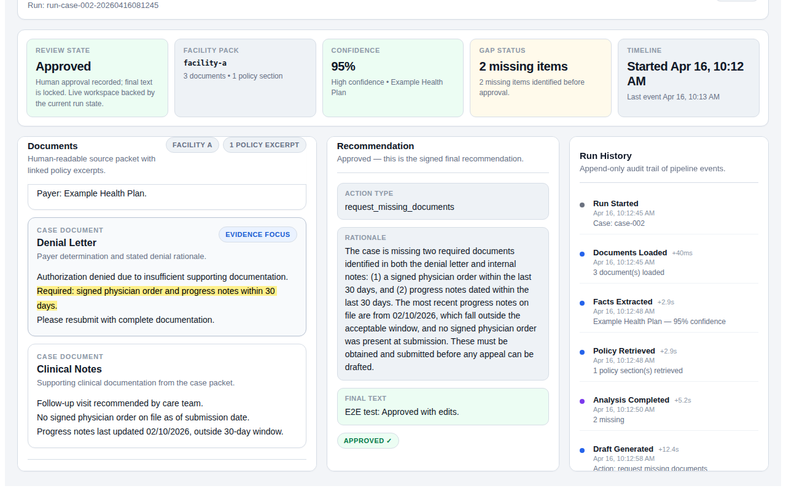
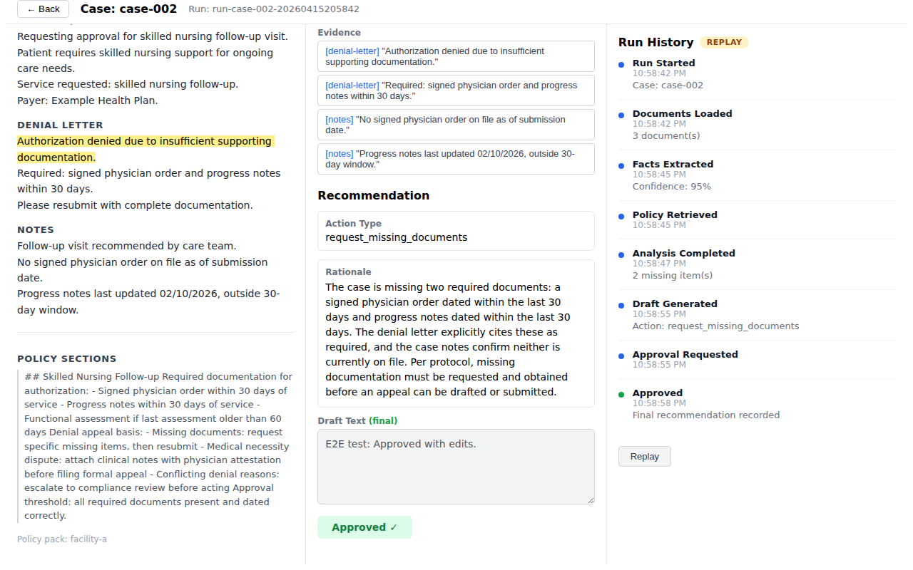
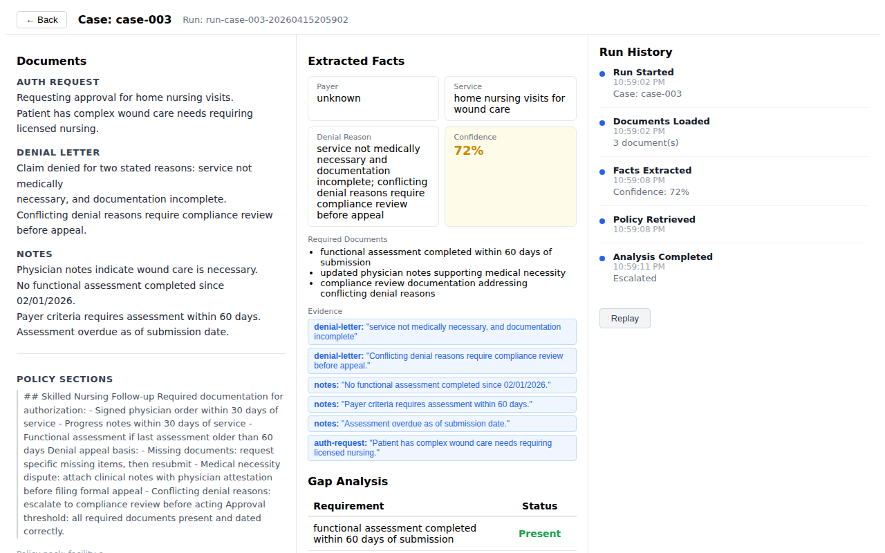

# Denial Review Workbench

**Auditable human-in-the-loop denial review for document-heavy healthcare ops**

Denial review pipelines process a full case — extraction, gap analysis, draft — typically in under 15 seconds. Replay any approved run: status is preserved, no model call is made, and the JSONL log gains exactly one line. Verify it yourself: `./bench.sh`

---

## Overview

Denial Review Workbench is a thin, operator-ready workflow tool for reviewing insurance authorization denials. It ingests a case packet — denial letter, auth request, clinical notes — runs a structured AI pipeline to extract facts, identify missing documentation, and draft a next action, then routes the result to a human reviewer for approval or escalation. Every decision is logged to an append-only JSONL event store and can be replayed deterministically without touching the model.

---

## Demo Arc

A caseworker opens case-002 — a skilled nursing authorization denied for insufficient documentation. The left panel loads the denial letter, auth request, clinical notes, and the matching policy excerpt. They click **Run Review**.

The pipeline extracts facts from the denial packet, retrieves the relevant policy sections by keyword match, identifies two missing items — signed physician order and progress notes within 30 days — and drafts a next action. Confidence renders as a color-banded percentage. Each evidence reference is clickable and highlights the source quote in the document panel.

The reviewer edits one line of the draft, clicks **Approve**, and the run transitions to `approved`. The approved event carries `final_recommendation` — exactly what the human signed off on — as a first-class audit artifact.

Opening Run History shows the full event timeline. Clicking **Replay** reconstructs the complete run state from the JSONL log without calling the model. An amber **REPLAY** badge confirms the reconstruction is read-only.

case-003 demonstrates the escalation branch: conflicting denial reasons trigger `should_escalate: true`, the draft and approve UI are suppressed, and the center panel shows an escalation notice. The server returns 409 on any approve attempt — the guard is enforced at the API layer, not just the UI.

---

## Screenshots

### Case Queue
The triage queue lists all cases with facility, scenario, expected path, and summary columns. Reviewers pick a case and click **Run Review** to start the pipeline.



### Run Results — Three-Panel Layout
A persistent summary header shows status, facility, confidence, missing-item count, and start time. Left panel: denial letter, auth request, clinical notes, and retrieved policy excerpts. Center panel: extracted facts with color-banded confidence, gap analysis table, and editable recommendation. Right panel: event timeline.



### Evidence Highlight
Clicking an evidence reference scrolls to the cited document and highlights the source quote with a yellow marker. An "Evidence focus" badge on the document confirms which source is active.



### After Approve
The reviewer edits the draft text and clicks **Approve**. The status transitions to `approved`, the textarea locks into a read-only "Final Text" display, and the event timeline gains an "Approved" entry.



### Replay
Clicking **Replay** reconstructs the full run state from the JSONL event log — no model call is made. An amber REPLAY badge confirms the view is a read-only reconstruction.



### Escalation (case-003)
Conflicting denial reasons trigger `should_escalate: true`. A red banner blocks the workflow — no draft is generated, no Approve button is shown. The server enforces this with a 409 guard on the approve endpoint.



---

## Architecture

```
┌─────────────────────────────────────────────────────────┐
│                    Three-Panel UI                        │
│  Documents + Policy  │  Facts + Gap + Draft  │  History  │
└──────────────────────┴───────────────────────┴───────────┘
                              │
                    POST /runs (sync)
                              │
┌─────────────────────────────────────────────────────────┐
│                   FastAPI Backend                        │
│                                                          │
│  extract_facts → policy_search → analyze_gap →          │
│  draft_next_action (if not escalated)                    │
│                                                          │
│  All calls through anthropic_client.py (single entry)   │
│  At most 3 model calls per run                           │
└──────────────────────────────┬──────────────────────────┘
                               │
              ┌────────────────┴────────────────┐
              │         JSONL Event Store        │
              │  data/runs/{run_id}.jsonl        │
              │  Append-only. Never rewritten.   │
              │  Full payloads for replay.       │
              └────────────────┬────────────────┘
                               │
              ┌────────────────┴────────────────┐
              │            replay.py             │
              │  Read-only JSONL reconstruction  │
              │  Never calls model providers     │
              │  Never writes new events         │
              └─────────────────────────────────┘
```

**Three model calls, strict order:**
1. `extract_facts` — payer, service, denial reason, confidence, evidence refs
2. `analyze_gap` — missing items, conflicts, escalation decision
3. `draft_next_action` — only when `should_escalate` is false

**V1 run statuses:** `approval_requested` → `approved` or `escalated`

**Replay invariant:** The `approved` event carries `final_recommendation` — exactly what the human signed off on. Replay reconstructs this from the JSONL log without any model call.

**Run logs** are append-only JSONL. Each event is typed, timestamped, and replayable. Format is one translation layer from OpenTelemetry spans.

---

## Tech Stack

| Layer | Technology |
|-------|-----------|
| Backend | FastAPI, Python 3.11+, Pydantic v2, uvicorn |
| Frontend | React 18, TypeScript, Vite, Bun |
| Model | Anthropic claude-sonnet-4-6 |
| Storage | Append-only JSONL event log |
| Schemas | Pydantic (backend) mirrored to TypeScript interfaces (frontend) |

---

## Running Locally

**Prerequisites:** Python 3.11+, Bun, Anthropic API key

```bash
git clone https://github.com/yuan-cloud/denial-review-workbench
cd denial-review-workbench
```

**Backend:**

```bash
cp backend/.env.example backend/.env
# add your Anthropic API key to backend/.env
cd backend
set -a; source .env; set +a
pip install fastapi uvicorn anthropic pydantic
uvicorn app.main:app --reload --port 8000
```

Verify: `curl http://localhost:8000/health`
Expected: `{"status":"ok","phase":"3"}`

**Frontend:**

```bash
cd frontend
bun install
bun run dev
```

Opens at `http://localhost:5274`

**Environment variables:**

| Variable | Default | Description |
|----------|---------|-------------|
| `ANTHROPIC_API_KEY` | — | Required for live pipeline |
| `VITE_PORT` | `5274` | Frontend port |
| `FRONTEND_URL` | `http://localhost:5274` | CORS allowed origin |
| `VITE_API_BASE` | `http://localhost:8000` | Backend URL for frontend |

---

## Case Structure

Three synthetic cases cover the full decision space:

| Case | Path | Expected outcome |
|------|------|-----------------|
| `case-001` | Happy path — all docs present | `approve_or_proceed`, confidence ≥ 0.85 |
| `case-002` | Missing docs — main demo case | `request_missing_documents`, 2 missing items |
| `case-003` | Conflicting denial reasons | `escalated`, recommendation null |

Policy files live in `data/policies/`. Swapping policy packs and approval rules is how this scales across facilities — the orchestration spine stays the same.

---

## Troubleshooting

If a run fails, use the case-002 fallback endpoint:

```
GET /demo-fallback/case-002
```

Returns the saved mock run for case-002 so you can inspect the Recommendation or Run History panel state.

---

## Build Methodology

Built with multiple AI coding agents (Claude Code, Codex) working in parallel from a shared operating contract (`AGENTS.md`). Agents coordinate through message passing and file reservations, commit independently to `main`, and run automated bug scanning before every commit. Task graph, session search, and orchestration are scripted — no manual dispatch.

---

## Security

```bash
grep -r "PHI\|patient_name\|ssn\|date_of_birth" \
  data/ backend/ frontend/src/ \
  --include="*.py" --include="*.tsx" \
  --include="*.json" --include="*.md"
```

Returns empty. No patient identifiers in any synthetic case data.
